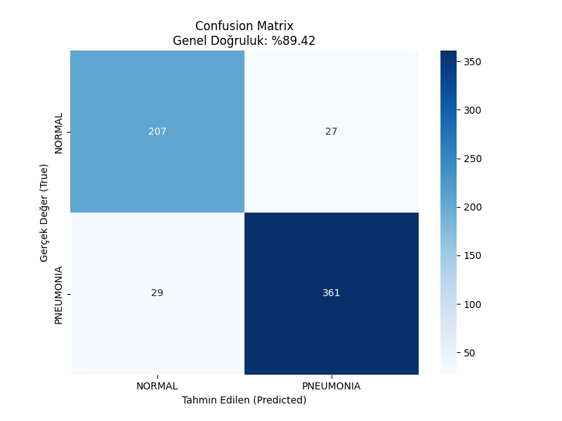
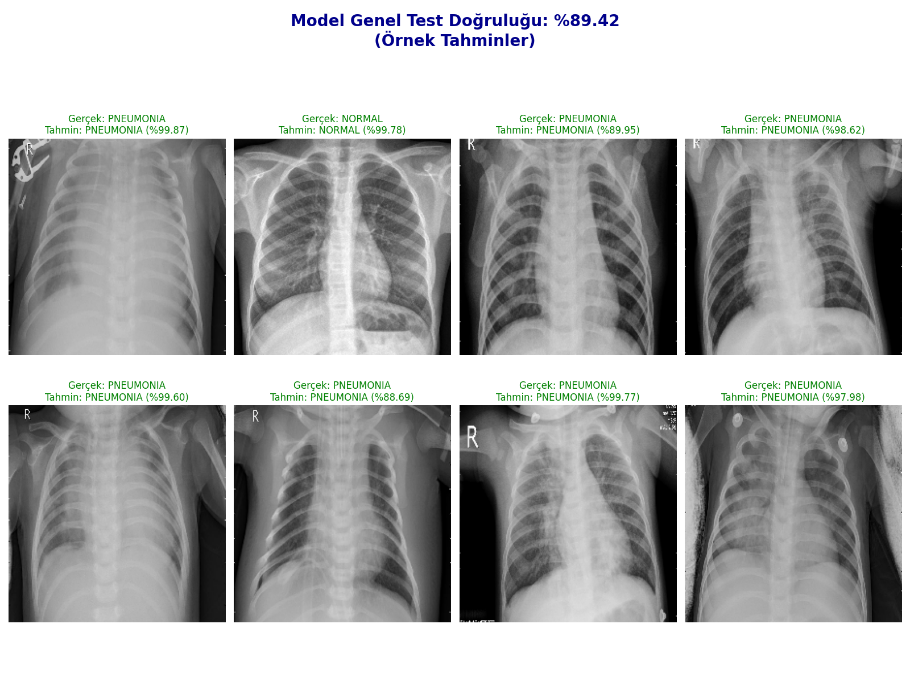

# 🩺 Chest X-Ray Pneumonia Detection

Bu proje, göğüs röntgeni (X-Ray) görüntülerinden Zatürre (Pneumonia) teşhisini otonom olarak koyabilen yüksek doğruluklu bir Derin Öğrenme modelidir.

## 🚀 Proje Özeti
Model, tıbbi görüntüleme verilerindeki dengesiz dağılımı ve düşük kontrast sorunlarını aşarak **%91 F1-Score (Dengeli Başarı)** oranına ulaşmıştır. Gerçek dünya senaryolarına uygun, "False Negative" (hastayı kaçırma) oranını minimize eden bir yapı kurulmuştur.

## 🛠️ Kullanılan Teknolojiler
* **Dil:** Python 
* **Kütüphaneler:** TensorFlow, Keras, OpenCV, NumPy, Matplotlib
* **Model:** MobileNetV2 (Transfer Learning)
* **Veri Yönetimi:** Google Colab (GPU T4), Google Drive Integration

## 📊 Model Performansı ve Görseller

### 1. Confusion Matrix (Hata Matrisi)

**Açıklama:**
* **Dengeli Tahmin:** Model, "Normal (Sağlıklı)" sınıfındaki 234 görüntünün 207'sini, "Zatürre" sınıfındaki 390 görüntünün ise 361'ini doğru teşhis etmiştir. Hata sayılarının (27'ye karşı 29) birbirine bu kadar yakın olması, modelin son derece dengeli ve tarafsız bir performans sergilediğini gösterir.
* **Güvenilirlik:** Sınıflar arasındaki hata dağılımının birbirine yakın olması, modelin objektif bir karar mekanizması geliştirdiğini ve teşhis koyarken tutarlı davrandığını gösterir.

### 2. Model Success Samples (Tahmin Örnekleri)

**Açıklama:**
* Bu görselde modelin test setindeki rastgele seçilmiş resimler üzerindeki tahminlerini görebilirsiniz.
* Model, farklı kontrast ve açıdaki röntgenlerde bile yüksek güven (Confidence) skorları ile doğru teşhis koyabilmektedir.

### 3. Classification Report (Sınıflandırma Raporu)
| Class | Precision | Recall | F1-Score |
| :--- | :---: | :---: | :---: |
| **Normal** | 0.88 | 0.88 | 0.88 |
| **Pneumonia** | 0.93 | 0.93 | 0.93 |
| **Average / Total** | **0.91** | **0.91** | **0.91** |

**Analiz:**
* **Recall (Duyarlılık):** Zatürre sınıfındaki yüksek Recall değeri, hasta olan bireylerin doğru tespit edilme oranının çok yüksek olduğunu gösterir.
* **F1-Score:** %91'lik F1 skoru, modelin sadece yüksek tahmin yapmakla kalmadığını, aynı zamanda hem hasta hem de sağlıklı vakaları birbirinden ayırırken ne kadar dengeli ve tutarlı bir performans sergilediğini kanıtlar.

## 💡 Uygulanan Teknik Stratejiler
* **Oversampling:** sample_from_datasets ve %60-%40 ağırlıklandırma ile sınıflar arası veri dengesi (Imbalance) sağlandı.
* **Data Augmentation:** RandomFlip, Rotation, Translation ve Zoom katmanları ile modelin genelleme yeteneği artırıldı.
* **MobileNetV2 Preprocessing:** Pikseller preprocess_input ile modelin beklediği [-1, 1] aralığına çekildi.
* **Label Smoothing:** Modele "hiçbir zaman %100 emin olma" talimatı verilerek etiket gürültüsü (insan kaynaklı hatalı etiketler) kompanse edildi. Bu sayede modelin hatalı etiketleri körü körüne ezberlemesi (overfitting) engellendi ve daha esnek bir karar mekanizması geliştirildi.
* **Learning Rate Scheduler:**  ReduceLROnPlateau ile eğitim sırasında performansın durakladığı anlarda hız otomatik düşürülerek en iyi sonuca odaklanıldı.
* **Fine-Tuning:** Dondurulmuş MobileNetV2 katmanlarının son 30 tanesi serbest bırakılarak modele özgü ince ayar yapıldı.
* **Early Stopping:** Eğitim sırasında val_loss takibi yapıldı. Modelin öğrenmesi durduğunda eğitim otomatik kesilerek gereksiz işlem gücü harcanmadı ve overfitting (ezberleme) riski ortadan kalktı. restore_best_weights parametresiyle de en başarılı ağırlıklar otomatik olarak geri yüklendi.
